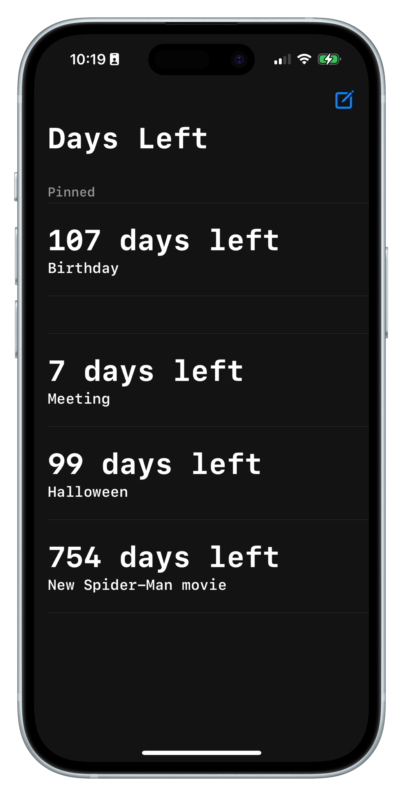

# DaysLeft

DaysLeft is an iOS application built with SwiftUI that helps you keep track of the days remaining until important events. It includes a configurable widget so you can view your countdowns directly from the Home Screen or Lock Screen.

## Features

- Create, edit and delete events with target dates
- Countdown in days until each event
- Pin important events to the top of the list
- Haptic feedback on important actions
- Home Screen widget with small and medium layouts

## Getting Started

1. Open `DaysLeft.xcodeproj` in Xcode (iOS 17 or later).
2. Build and run the **DaysLeft** target on your device or simulator.
3. The main screen will show an empty list the first time you launch the app. Tap the compose button to add a new event.

## Usage

- **Add a Day** – Tap the button with the pencil icon and fill in the form with a name and target date.
- **Edit or Delete** – Swipe an entry to reveal actions for pinning, editing or deleting.
- **Widget** – Long‑press your Home Screen, add the widget named **Left**, and choose which day to display.

The widget displays a minimalist calendar view that adapts depending on whether the event is days, months or years away.

## What is this project for?

DaysLeft provides a simple way to count down to multiple upcoming events, such as vacations, birthdays or deadlines. With the optional widget you can see at a glance how much time is left without opening the app.

## Screenshots

| App | Widget |
|-----|--------|
|  |  |

